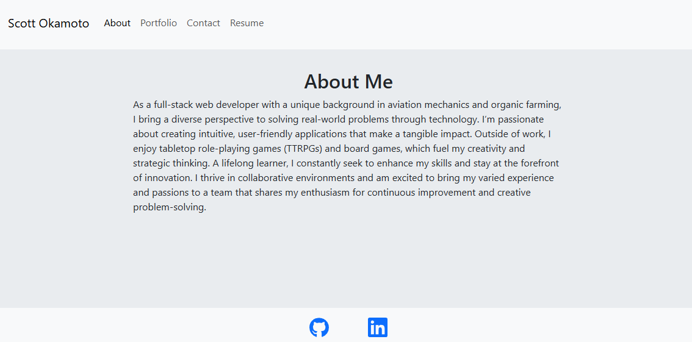

# Scott Okamoto's Portfolio
- [Link to GitHub repository](https://github.com/swokamoto/portfolio-yeah)
- [Link to deployed site](tranquil-sorbet-ff95c3.netlify.app)
## Table of Contents

- [Scott Okamoto's Portfolio](#scott-okamotos-portfolio)
  - [Table of Contents](#table-of-contents)
  - [Description](#description)
  - [Installation](#installation)
  - [Usage](#usage)
  - [Contributing](#contributing)
  - [Questions](#questions)
## Description
This is my personal portfolio. It is a work-in-progress, as I will be updating it as I complete projects and learn new skills.

## Installation
Run `npm install` to get the required packages. 
## Usage
To start the application, enter `npm start`. Follow http://localhost:3000/.
## Contributing
Please follow the [Contributor Covenant](https://www.contributor-covenant.org/) guidelines.
## Questions
If you have any questions, please reach out to me at swokamoto@gmail.com. 